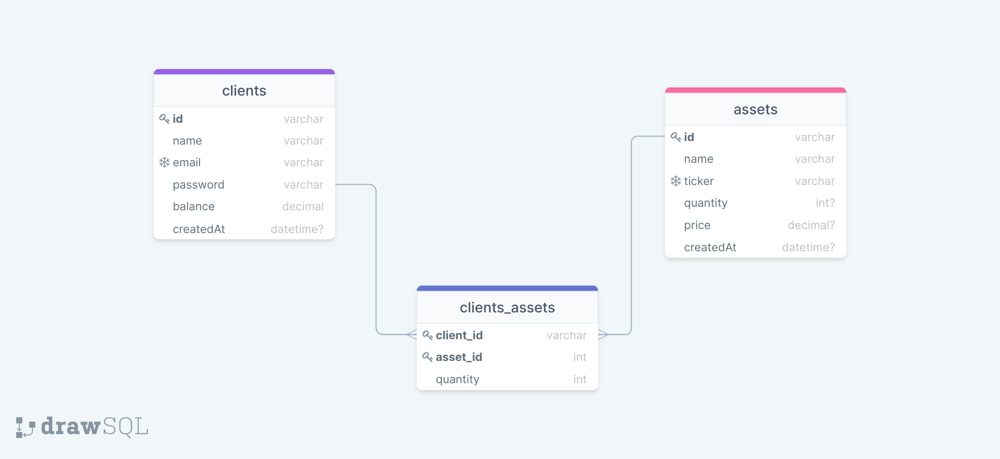

# Wallet XP

### Uma Aplicação RestFul que se assemelha ao dia-a-dia de uma corretora de investimentos/banco digital. 

Nessa API é possível realizar compra e venda de ativos e realizar CRUD de usuários.
<br />
#
## Diário de Desenvolvimento

#### Para o desenvolvimento do fluxo de trabalho foi feita a seguinte divisão de branches
#### levando em consideração (ainda que parcialmente) a filosofia do git flow. <p>Bloqueando a **MAIN** para aceitar somente *pull requests* e *merge* apenas após review</p>
<br />


Para saber mais sobre [Git Flow](https://blog.knoldus.com/introduction-to-git-flow/)

<br />

### Para estruturar o banco de dados optamos, por utilizar um Banco Relacional <strong> (SQL)</strong> seguindo os princípios <strong>ACID.
<br />

Para ajudar na concepção das tabelas, utilizamos o seguinte Diagrama Entidade Relacionamento (DER)

<br />

**DER** - Diagrama-Entidade-Relacionamento


**Tabelas** e suas finalidades:
<br />

| Tabela                   | Finalidade                               |
|------------------------- | -----------------------------------------|
| clients            | Relação de clientes                      |
| assets             | Relação de Produtos financeiros disponíveis na corretora   |
| clients_assets       | Relação de Produtos de um cliente        |

Toda a estrutura de pasta bem como a implementação da API foi utilizando o modelo MSC (Models, Controllers e Services)

<p align="center">
  
</p>

Para saber mais sobre os princípios [ACID](https://www.ibm.com/docs/en/cics-ts/5.4?topic=processing-acid-properties-transactions)

Para saber mais sobre [DER](https://www.lucidchart.com/pages/pt/o-que-e-diagrama-entidade-relacionamento)
#
## Rodando localmente (Com DOCKER)

<br/>

<details>
    <summary><strong>🐋 Pré-Requisitos - DOCKER</strong></summary>

  -  Ter instalado em sua máquina o **docker** e **docker-compose**.<p>
  (Caso não tenha instalado ainda, [Veja esse guia](https://www.digitalocean.com/community/tutorials/how-to-install-and-use-docker-compose-on-ubuntu-20-04-pt) ou a [documentação](https://docs.docker.com/compose/install/))
    
  -  Lembre-se de parar qualquer serviço que esteja rodando na mesma porta indicada no docker-compose.
    
  - Instale as dependências com **npm install**. (Instale dentro do container)
  
  - O git dentro do container não vem configurado com suas credenciais. <p> Faça os commits **fora do container**, ou configure as suas credenciais do git dentro do container.
</details>

<br/>

Clone o projeto

```bash
  git clone https://github.com/samuel-santiago/wallet-XP
```

Entre no diretório do projeto

```bash
  cd wallet-xp
```

Instale as dependências

```bash
  npm install
```

Inicie o servidor

```bash
  npm run start
```

**Crie o arquivo dotenv conforme .env.example (ou seção "Variáveis de Ambiente")**


Inicie o servidor utilizando o docker compose:

```bash
  docker-compose up -d
```

## Rodando os testes - Em desenvolvimento

```bash
  npm run test:coverage
```
#

## Deploy (Em desenvolvimento)

O deploy deste projeto será realizado no Heroku. 

#
## Documentação da API

#### Cadastra um novo cliente pelo dados passados no corpo da requisição

```http
  POST /clients
```

#### Deleta um cliente pelo código passado no corpo da requisição

```http
  DELETE /clients
```
#### Retorna o cliente pesquisado pelo código

```http
  GET /conta/:code
```
#### Insere um depósito na conta de acordo com dados passados na requisição.

```http
  POST /conta/deposito
```

#### Saca dinheiro da conta de acordo com os dados passados na requisição.

```http
  POST /conta/saque
```

#### Compra um ativo, adicionando na carteira do cliente e descontando do saldo.

```http
  POST /investimentos/comprar
```
#### Vende um ativo, removendo na carteira do cliente e corrigindo o saldo.

```http
  POST /investimentos/vender
```

#### Retorna a situação da carteira da pessoa com todos os seus ativos e informações relacionadas.

```http
  GET /ativos/{cod-cliente}
```

#### Retorna os dados referentes ao ativo pesquisado com quantidade e valor.

```http
  GET /ativos/{cod-ativo}
```
#
## Variáveis de Ambiente

#### Para rodar esse projeto, você vai precisar adicionar as seguintes variáveis de ambiente no seu .env (renomeie e utilize o arquivo .env.example)
<br>

`DATABASE_URL`
Essa variável faz a conexão com o Prisma ORM

`PORT`
É a porta que o serviço da API irá rodar.
#
## Desenvolvimento Contínuo 

#### Ainda não terminei o desenvolvimento de toda a API, pretendo desenvolver os seguintes tópicos.
<br>

- [ ] Implementar autenticação nas rotas (JWT)
- [ ] Refatorar utilizando princípios SOLIC (principalmente segregação de Interfaces)
- [ ] Implementar Quality Gates com GH Actions (Lint, Tests e Sonar)
- [ ] Documentar com Swagger
- [ ] 80% de Cobertura com testes unitários (Jest/SuperTest)
- [ ] Implementar testes de Integração (Postman)
- [ ] Utilizar encriptagem nos seeders e nas rotas (bcrypt)
- [ ] Inserir middleware de CORS()

